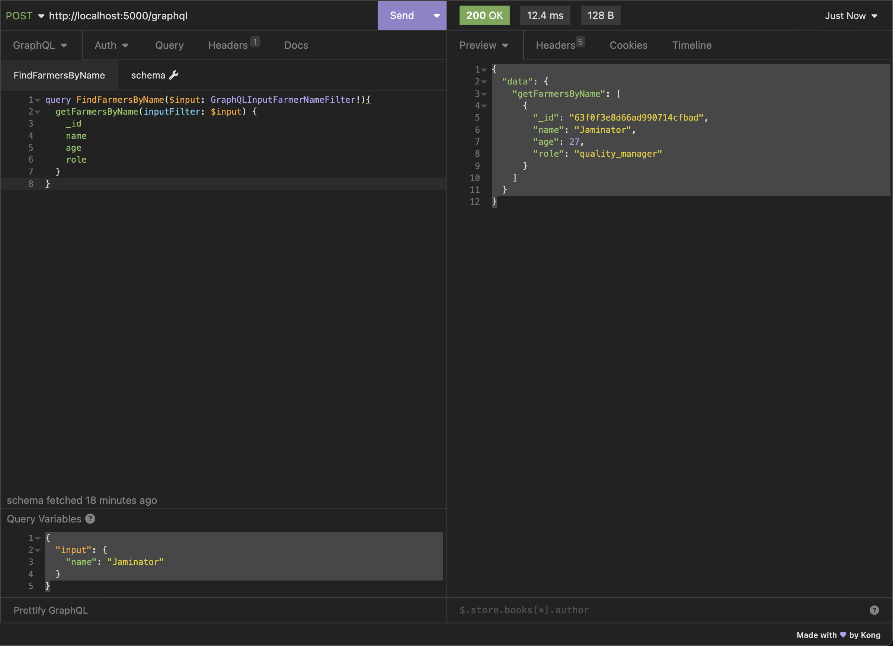
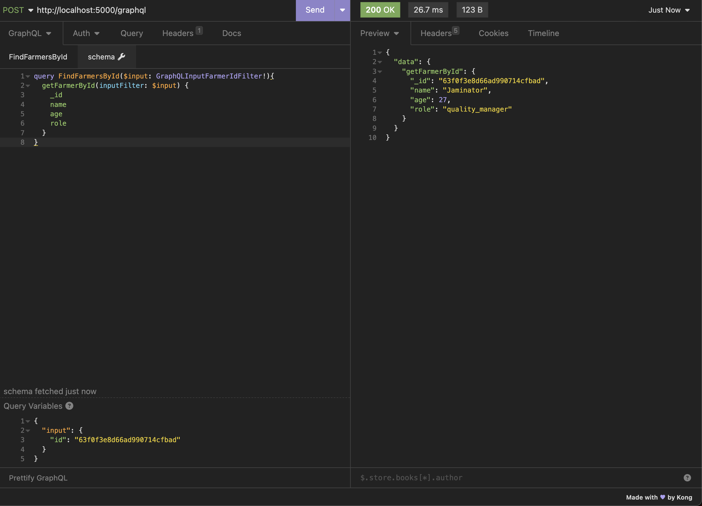

# strawberry-flask-pydantic-pymongo boilerplate

This is a boilerplate for a GraphQL API using Strawberry, Flask and PyMongo.

## Setting up the boilerplate

We use python 3.9.6 for this boilerplate

#### Creating a virtual environment and activating it

```commandline
virtualenv venv -p $(which python3.9)
source venv/bin/activate
```

#### Installing requirements

```commandline
pip3 install -r requirements.txt
```

## Spinning up a local mongo instance

Run the following command to spin up a local mongo instance on port 27017, as a background process / daemon

```commandline
mongod --config /usr/local/etc/mongod.conf --fork
```

We can then connect to our local mongo instance with 

```commandline
mongo
```

## Targetting a remote mongo database

Please change `settings.py`'s `MONGO_URL` to your remote mongo's connection string.

## Running the server on port 5000

```commandline
(venv) ➜  strawberry_with_flask_pydantic_pymongo git:(master) ✗ python3 main.py
 * Serving Flask app 'main'
 * Debug mode: off
WARNING: This is a development server. Do not use it in a production deployment. Use a production WSGI server instead.
 * Running on http://127.0.0.1:5000
Press CTRL+C to quit
```


## Making a dummy request to the server - POST `http://localhost:5000/graphql`

**1. Calling a Query - Getting a string as an output**

POST `http://localhost:5000/graphql`

Graphql Query

```
query HelloWorld {
	hello
}
```

Graphql Output

```
{
	"data": {
		"hello": "Hello World!"
	}
}
```


**2. Calling a Query - Getting a custom GraphQL Output Type**

POST `http://localhost:5000/graphql`

Graphql Query

```
query GetSampleFarmer {
	getSampleFarmer {
		_id
		name
		age
		role
	}
}
```

Graphql Output

```
{
	"data": {
		"getSampleFarmer": {
			"_id": "dummy_id",
			"name": "Patrick",
			"age": 25,
			"role": "grower"
		}
	}
}
```


**3. Calling a Mutation - Inserting a Strawberry Farmer**

POST `http://localhost:5000/graphql`

Graphql Mutation

```
mutation CreateFarmer($input: GraphQLInputStrawberryFarmer!){
	createFarmer(farmer: $input) {
		id
		success
	}
}
```

Graphql Variables

```
{
	"input": {
		"age": 27,
		"name": "Jaminator",
		"role": "quality_manager"
	}
}
```

Graphql Output

```
{
	"data": {
		"createFarmer": {
			"id": "63f0f3e8d66ad990714cfbad",
			"success": true
		}
	}
}
```


**4. Calling a Query - Query Farmers by Name**

POST `http://localhost:5000/graphql`

Graphql Query

```
query FindFarmersByName($input: GraphQLInputFarmerNameFilter!){
	getFarmersByName(inputFilter: $input) {
		_id
		name
		age
		role
	}
}
```

Graphql Variables

```
{
	"input": {
		"name": "Jaminator"
	}
}
```

Graphql Output

```
{
	"data": {
		"getFarmersByName": [
			{
				"_id": "63f0f3e8d66ad990714cfbad",
				"name": "Jaminator",
				"age": 27,
				"role": "quality_manager"
			}
		]
	}
}
```



**5. Calling a Query - Query Farmer by Id**

POST `http://localhost:5000/graphql`

Graphql Query

```
query FindFarmersById($input: GraphQLInputFarmerIdFilter!){
	getFarmerById(inputFilter: $input) {
		_id
		name
		age
		role
	}
}
```

Graphql Variables

```
{
	"input": {
		"id": "63f0f3e8d66ad990714cfbad"
	}
}
```

Graphql Output

```
{
	"data": {
		"getFarmerById": {
			"_id": "63f0f3e8d66ad990714cfbad",
			"name": "Jaminator",
			"age": 27,
			"role": "quality_manager"
		}
	}
}
```

